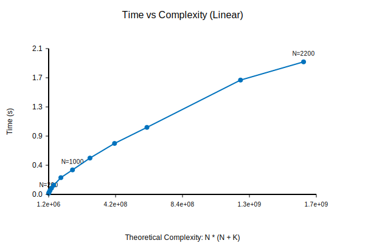

# Relatório 1º projecto ASA 2025/2026

**Grupo:** ALxxx/TPyyy
**Aluno(s):** Nome1 (97xxx) e Nome2 (102xxx)

---

## Descrição do Problema e da Solução

O problema consiste em calcular o número de caminhos distintos entre pares de cruzamentos num grafo orientado acíclico (DAG) e, com base nisso, atribuir rotas a camiões. A solução proposta utiliza uma abordagem iterativa baseada na ordenação topológica para garantir que os nós são processados na ordem correta de dependência, evitando recursão e problemas de stack overflow.

Para otimizar o uso da cache e memória, implementámos um esquema de **Programação Dinâmica por Lotes (Batched DP)**. Processamos os nós de origem em blocos (ex: 128), mantendo contadores de caminhos apenas para o lote atual. A propagação dos caminhos é feita seguindo a ordem topológica linearizada (algoritmo de Kahn), onde para cada nó somamos os caminhos vindos dos seus antecessores e propagamos para os sucessores, atualizando os contadores módulo $M$.

## Análise Teórica

O algoritmo divide-se nas seguintes etapas principais:

1.  **Leitura do Grafo e Cálculo de Graus de Entrada**:
    Iteração sobre as $K$ arestas para construir a lista de adjacências e vetor de graus.
    **Complexidade:** $O(N + K)$

2.  **Ordenação Topológica (Algoritmo de Kahn)**:
    Inserção de nós com grau 0 numa fila e remoção iterativa, visitando cada aresta uma vez.
    **Complexidade:** $O(N + K)$

3.  **Processamento por Lotes (Core da Solução)**:
    Para cada bloco de origens, percorremos o grafo na ordem topológica. No pior caso (grafo denso), processamos todas as arestas para cada lote. Sendo $B$ o tamanho do lote, temos $N/B$ iterações externas.
    **Complexidade:** $O(\frac{N}{B} \times (N + K))$

**Complexidade Global da Solução:**
Dado que $B$ é uma constante, a complexidade simplifica para:
$$O(N \times (N + K))$$

No pior caso (grafo denso onde $K \approx N^2$), temos $O(N^3)$. Para grafos esparsos, aproxima-se de $O(N^2)$.

## Avaliação Experimental dos Resultados

As experiências foram realizadas num computador com CPU Apple M-series, utilizando instâncias geradas aleatoriamente com densidade constante. O objetivo foi verificar a correlação entre o tempo de execução e a complexidade teórica prevista $O(N \times (N+K))$.

### Tabela de Resultados
Foram geradas mais de 10 instâncias de tamanho incremental.

| N (Vértices) | K (Arestas) | Tempo (s) |
| :--- | :--- | :--- |
| 200 | 5937 | 0.0172 |
| 300 | 13620 | 0.0326 |
| 400 | 24075 | 0.0595 |
| 500 | 37572 | 0.0930 |
| 600 | 53856 | 0.1348 |
| 800 | 96280 | 0.2466 |
| 1000 | 149645 | 0.3608 |
| 1200 | 215511 | 0.5350 |
| 1400 | 294370 | 0.7506 |
| 1600 | 384045 | 0.9868 |
| 2000 | 599803 | 1.6834 |
| 2200 | 724530 | 1.9516 |

### Gráfico de Desempenho
O gráfico abaixo apresenta o Tempo Real (eixo YY) em função da Complexidade Teórica $N \times (N+K)$ (eixo XX).

A linearidade observada no gráfico confirma que a implementação segue a previsão teórica.
